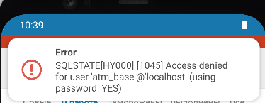
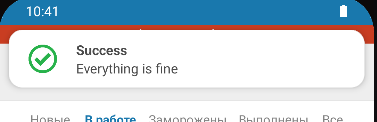
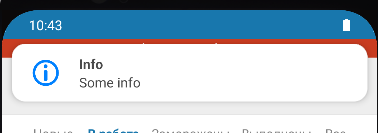

### Description

Local notifications for React Native app

### Installation

```sh
npm i --save rn-awesome-notifications
```


### Usage

In root Component

```
import { NotificationProvider } from "rn-awesome-notifications";

<NotificationProvider>
  ...
</NotificationProvider>
```

In your Component

```
import { useNotify } from "rn-awesome-notifications";

const MyComponent: React.FC = () => {
  
  const notify = useNotify();
  
  return (
    <Button
      title="Without buttons and icon"
      onPress={() => {
        notify({
          title: "Test push notification",
          message: "This is push was recievd from local storage",
        })
      }}
    />
  )
}
```

### Examples

```
notify.error({
    title: 'Error',
    message,
    timeout: 15000,
});
```


```
notify.success({
    title: 'Success',
    message: 'Everything is fine',
    timeout: 15000,
});
```


```
notify.info({
    title: 'Info',
    message: 'Some info',
    timeout: 15000,
});
```

